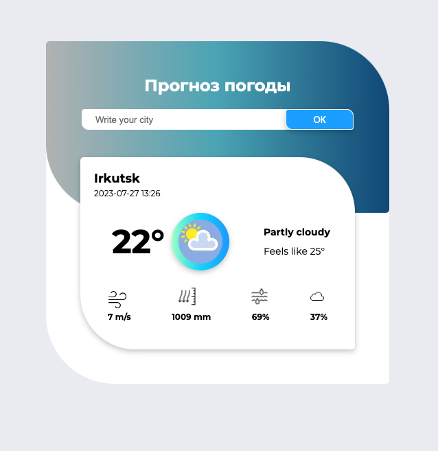
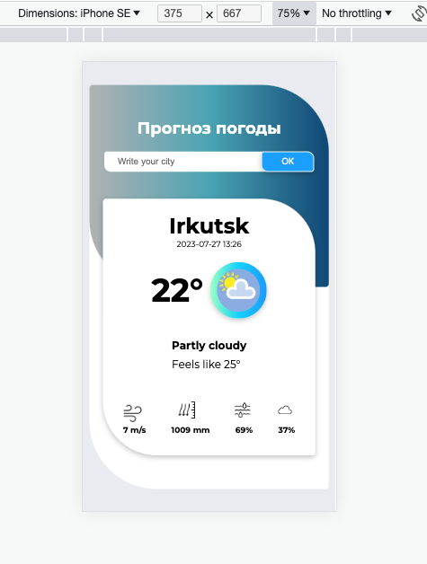
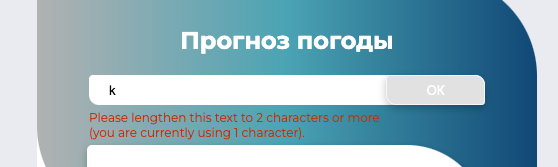
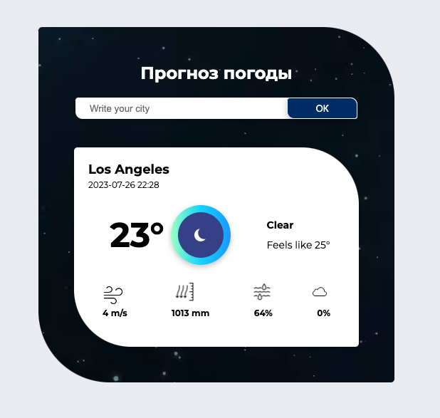
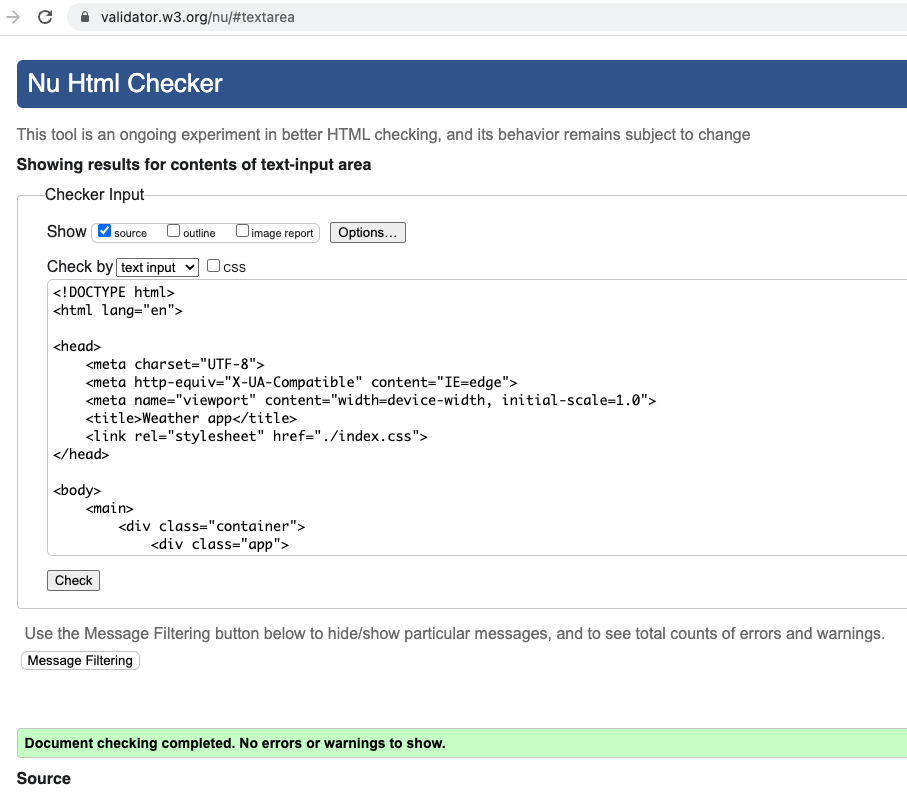

# Weather-forecast-app

Приложение прогноза погоды

## Цель: 

Создать приложение прогноза погоды с использованием API стороннего сервиса, адаптированное под различные типы устройств.

## Использованныe технологии:
* HTML
* CSS
* JS
* API / Fetch
* Local Storage
 

## Реализованный функционал:
*  Адаптивность под все типы устройств (desktop и mobile)

 
*  Настроена валидация для формы вводы данных

 
*  Пиложение изменяет внешний дизайн в зависимости от времени суток

 
*  Приложение проверено через онлайн валидатор

 
*  Пиложение сохраняет последний выбранный город в local storage
